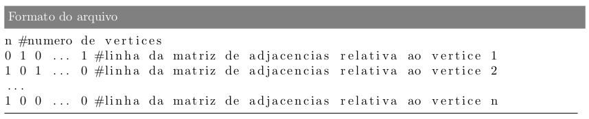
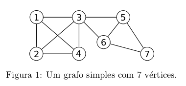
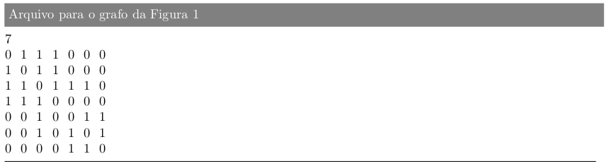
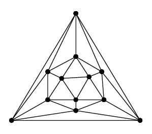
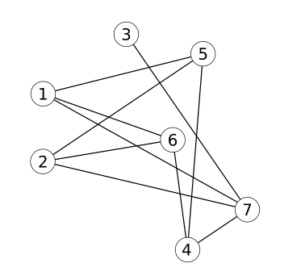

<h2 align="center"> Project 1| Initial Concepts about Graphs</h2>

Your program will read a graph informed through a text file. The file format is as follows:

1 - **Graph reading and representation**

Write code that reads the graph from a file and represents it in the two forms seen in class: adjacency matrix and adjacency list. In the next questions, take into account that both representations of the graph will be available to make implementations more efficient.

2 - **Minimum and maximum degrees**

Write a function that calculates the minimum degrees δ(G) and maximum Δ(G) of G. For the graph in Figure 1 (instance_1.txt), we have that δ(G)=2 and Δ(G)=5.

### Tradução do readme.md para o inglês

3 - **Degree Sequence**

Write a function that determines the degree sequence of G.

4 - **Degree and Neighborhood of a vertex v**

Write a function that determines the degree and the open and closed neighborhoods of a vertex v.

5 - **Adjacency**

Write a function that determines whether two distinct vertices u and v are neighbors (or adjacent). Remember that they are neighbors if the edge between them exists, that is, if (u,v)∈E. If so, it is said that u and v are the endpoints of such an edge.

6 - **Regularity**

A graph is regular if all its vertices have the same degree. If the degree of all vertices is equal to k, the graph is said to be k-regular. Write a function that informs whether G is regular, clearly stating the value of the degree if affirmative. Below is an example of a 5-regular graph.

7 - **Completeness**

Write a function that informs whether G is complete, that is, if it has all possible edges. Considering n as the number of vertices in G, we have seen in class that a simple graph can have from 0 to n(n−1)/2 edges. Therefore, the complete graph with n vertices, denoted by Kn, has n(n−1)/2 edges. Below is an illustration of the graph K7.

8 - **Universal Vertices**

Write a function that lists all the universal vertices of G, which are the vertices that are connected to all other vertices in the graph. The degree of a universal vertex is therefore equal to n−1.

9 - **Isolated Vertices**

Write a function that lists all the isolated vertices of G, which are the vertices that have no neighbors. The degree of an isolated vertex is therefore equal to 0.

10 - **Subgraphs**

Write a function that determines whether a list of vertices and a list of edges provided by the user represent a subgraph H of G. For H to be a subgraph of G, all its vertices and edges must be contained, respectively, in the sets of vertices and edges of G. In addition, the endpoints of all edges listed by the user must be contained in the set of vertices provided, otherwise it is not a graph because we would have an edge without both endpoints.

11 - **Walks**

A sequence of k vertices v1,v2,...,vk is a walk in G if, for every 1≤i≤k−1, it holds that vi and vi+1 are neighbors. This means that adjacent vertices in the sequence must be neighbors. There are no other restrictions to be considered in the definition of a walk, so it is possible, for example, to repeat vertices and edges. An example of a walk in the graph in Figure 1 is 1,2,3,4,3,6.

Write a function that determines whether a sequence of vertices constitutes a walk in G.

12 - **Paths**

A path is a walk that does not repeat vertices. The walk 1,2,3,4 is a path in the graph in Figure 1.

Write a function that determines whether a given sequence of vertices constitutes a path in G.

13 - **Cycles**

A cycle is a walk that does not repeat vertices, except for the first and last vertices, which are the same. The walk 1,2,4,3,1 is a cycle in the graph in Figure 1.

Write a function that determines whether a given sequence of vertices constitutes a cycle in G.

14 - **Trails**

A trail is a walk that does not repeat edges.

Write a function that determines whether a given sequence of vertices constitutes a trail in G.

15 - **Cliques**

A subset of vertices S⊆V is a clique of G if, for any two distinct vertices i,j∈S, there is an edge (i,j) in the graph. Therefore, the vertices of a clique are pairwise connected by an edge. The following sets are examples of cliques in the graph in Figure 1: {1,2},{1,2,3},{1,2,3,4}.

Write a function that determines whether a given set of vertices constitutes a clique of G.

16 - **Maximal Clique**

A clique S⊆V is said to be maximal if there is no other clique S′ such that S′⊇S. That is, if it is not possible to expand the set S by inserting one or more vertices in such a way that the resulting set is still a clique. The following sets are examples of maximal cliques in the graph in Figure 1: {1,2,3,4},{5,6,7}. Note that the set {1,2,3}, although a clique, is not maximal because it could be extended by adding vertex 4.

Write a function that determines whether a given set of vertices constitutes a maximal clique of G.

17 - **Complement**

The complement of G is a graph G¯=(V,E¯) that has the same vertices as G, but whose set of edges is the complement of the set of edges of G. Therefore, an edge (i,j) belongs to E¯ if and only if it does not belong to E. The graph below corresponds to the complement of the graph illustrated in Figure 1.

Write a function that takes a graph as a parameter and returns its complement. Note that the return of the function consists of a graph.

18 - **Independent Set**

A subset of vertices S⊆V is an independent set of G if, for any two distinct vertices i,j∈S, there is no edge (i,j) in the graph. The set {1,7} is an example of an independent set of the graph in Figure 1.

Using your answers from items 15 and 17, write a function that determines whether a given set of vertices constitutes an independent set of G.

## Running

At the root of the project, run the command `make`. To run an instance, simply execute the command `./concepts instances/\<instance_to_be_executed\>`
